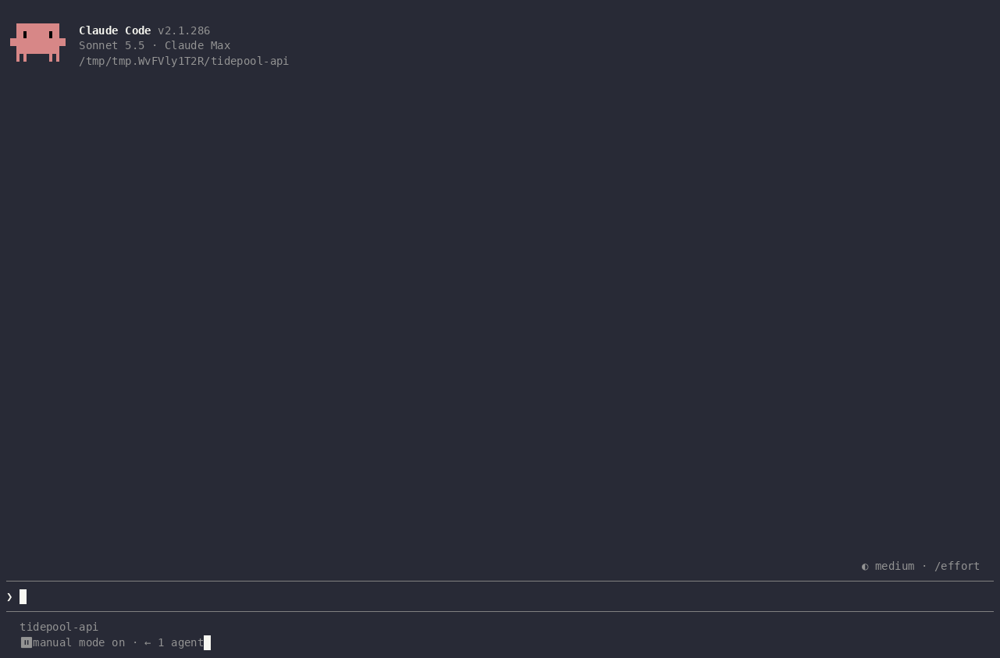

# session-decisions

**A queue for everything your assistant is waiting on you for.** Questions an assistant asks get
buried in long messages and scroll away; this plugin pins each one as a numbered card (`D1` for a
decision, `A1` for something only you can do) in the transcript, a sidebar and the footer, with a
recommendation you can accept in one click.



<sub>A real session, sped up while the assistant works. Asked to plan a SQLite to Postgres move
without writing code, it queues its decisions and actions. Accept all puts an answer line for
each recommendation in the prompt; one Enter settles them all, and only the actions stay
open.</sub>

## Install

```bash
claude plugin marketplace add lokkju/skills
claude plugin install session-decisions@lokkju
```

Restart Claude Code. There's nothing to configure; the skill tells the assistant when to queue
something, and the hook keeps it honest.

## How it works

### Asking

The assistant creates an ordinary task with a subject in one of two forms:

| Kind | Subject | Becomes |
| --- | --- | --- |
| Decision | `DECIDE: Postgres driver? (recommend psycopg 3) [#12]` | `D3 DECIDE: Postgres driver? (recommend psycopg 3) [#12]` |
| Action | `ACTION: Provision the target database [no link]` | `A2 ACTION: Provision the target database [no link]` |

A hook on TaskCreate assigns the label and refuses a decision with no recommendation, or any item
with no link, telling the assistant what's missing. The link is an issue (`#123`,
`owner/repo#123`), a merge or pull request (`!45`), a URL, or `no link`. An assistant that can't
write a recommendation isn't ready to ask yet, which is the point.

### Seeing

- **Transcript:** the row where the assistant asked becomes the item's card, and shrinks to
  `✓ D3 · <ruling>` once it's settled.
- **Sidebar:** in fullscreen, the first new item opens the queue beside the transcript (Claude
  Code only seats a pane it wasn't asked for from 144 columns). Close it and it stays closed
  until the queue empties, and then closes itself.
- **Footer:** while anything is open, `● 5 decisions` sits beside the mode labels. Click it to
  open the queue; Esc closes it.
- **Cards:** a `DECIDE` or `ACTION` chip, the label, a `recommends <choice>` tag, the question
  with any qualifier under it, the link, and the item's age, which turns red after a day.
- **Task list:** the items are tasks, so ctrl+t lists them too.

### Answering

**Accept** puts `D3: go with <the recommendation>` in your prompt, **Done** puts `A2: done`, and
**Answer** puts `D3: ` for you to finish. Each press adds or replaces that item's line, so one
message can answer several items; **Accept all** adds a line for every open recommendation. You
edit and send it like any other message, and the assistant marks each item completed with a
dated `Ruling (2026-10-08): ...` line. Completed items stay in the task list as the session's
record; `Settled (n)` in the sidebar shows them.

### Commands

| Command | What it does |
| --- | --- |
| `/decisions` | Lists the open items |
| `/decisions all` | Adds the settled ones, with their rulings |
| `/decisions pane` | Opens the sidebar |
| `/decisions wrap` | Has the assistant settle every open item before the session ends: escalate it to the tracker, carry it into the handoff, or drop it |

### After compaction

When a session is compacted or resumed, the assistant is reminded of what's still open, so a
question asked two hours ago doesn't silently fall out of context.

Labels are session-scoped. Anything recorded outside the session (commits, issues, pull
requests) carries the ruling and its date, never `D3`, which means nothing anywhere else.

## Requirements

Claude Code with function hooks, which interactive sessions and background jobs load. A plain
`claude -p` run doesn't load them unless `CLAUDE_CODE_ENABLE_FUNCTION_HOOKS=1` is set; there the
skill tells the assistant to number items itself.

Some child sessions (a session started from inside another Claude Code session, for one) don't
get TaskCreate. There the assistant uses the plugin's `decision_add` and `decision_close` tools
instead; the items show the same way, with a `ledger` tag on each card.

With `NO_COLOR` set or `TERM=dumb`, chips and glyphs fall back to ASCII (`[DECIDE]`, `+`, `x`).
Otherwise the cards use Claude Code's theme colors and follow your theme.

## How it stays in sync

The plugin never polls. It keeps the items in the session's plugin state and updates them from
TaskCreate and TaskUpdate calls as they finish; the footer, sidebar and cards redraw from that
state. It reads the task files once, at session start and after compaction or resume, to pick up
items it didn't see created. Label counters and the fallback ledger are kept per session in the
plugin's store, so a resumed session continues its numbering.

On VS Code and mobile there's no footer count (Claude Code only raises the footer on the terminal
and desktop); the transcript cards, the sidebar and `/decisions` work everywhere.

## Limits

- The task files are read from `~/.claude/tasks/<session id>/`, which Claude Code doesn't
  document. If that changes, items created before a resume or compaction stop showing until
  they're updated; labelling is unaffected.
- Two sessions sharing a task list (`CLAUDE_CODE_TASK_LIST_ID`) don't see each other's changes
  until their next session start.
- Function hooks are early access and their API can change between Claude Code releases.

## Development

```bash
claude plugin validate --strict plugins/session-decisions
claude plugin test plugins/session-decisions
```

For an editor or `tsc`, run `/plugin-types plugins/session-decisions/.claude/types` in Claude Code
to write the engine's declarations for your build (git ignores them), then
`npx -p typescript@5 tsc -p plugins/session-decisions/tsconfig.json`.

### Re-recording the demo

`docs/record-demo.sh` drives a real session in a 150x42 tmux pane: it types the prompt, waits for
the assistant, clicks Accept all, sends the answers, and renders the capture with
[agg](https://github.com/asciinema/agg). It needs `tmux`, `jq`, `claude` and `agg` on PATH and
spends one short Sonnet conversation.

```bash
bash plugins/session-decisions/docs/record-demo.sh   # writes docs/demo.gif
```

Run it from a normal terminal. From inside a Claude Code session, the recorded session is a child
session without TaskCreate, and the cards show the `ledger` tag.
